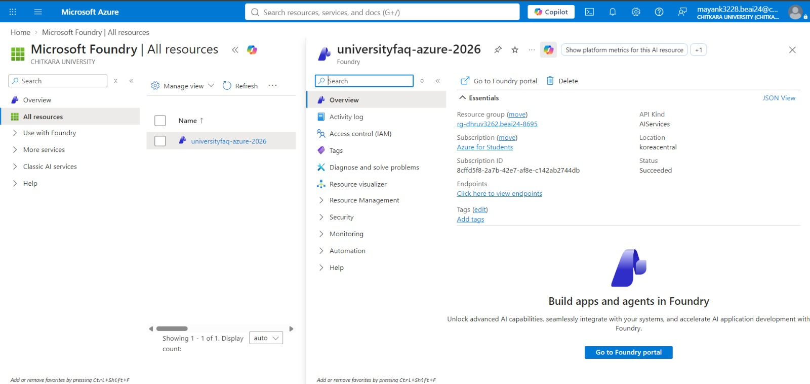
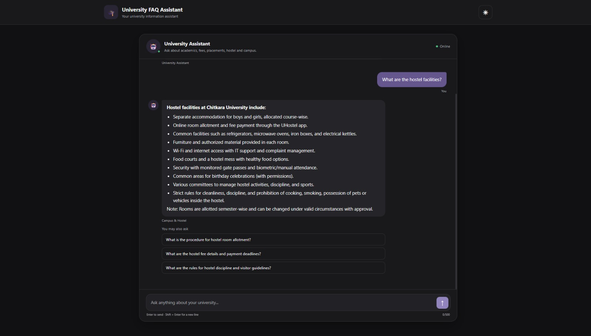
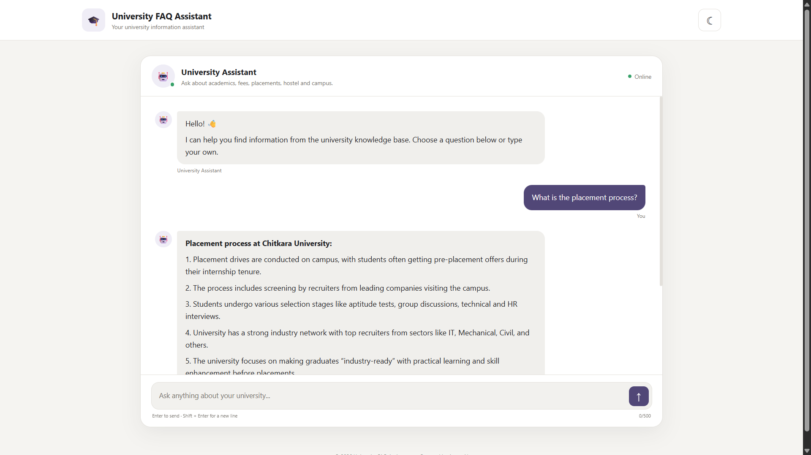
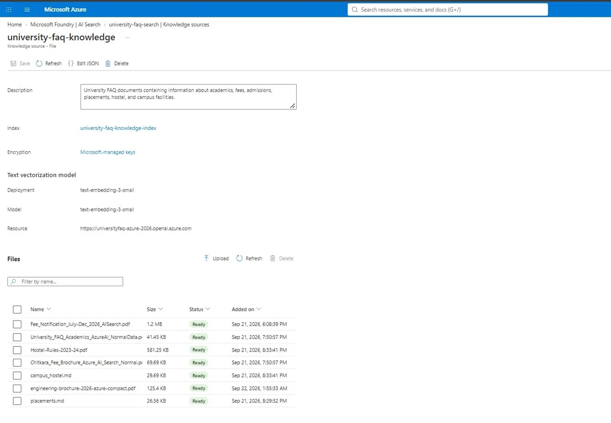
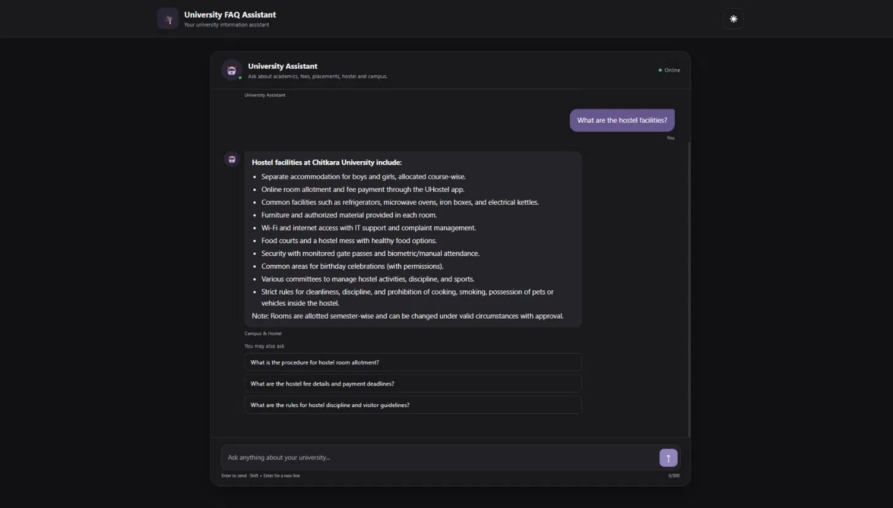
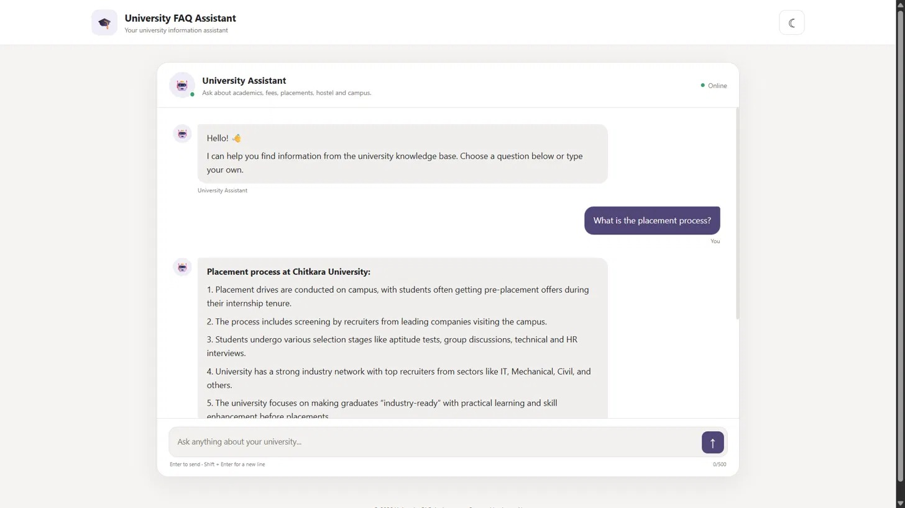
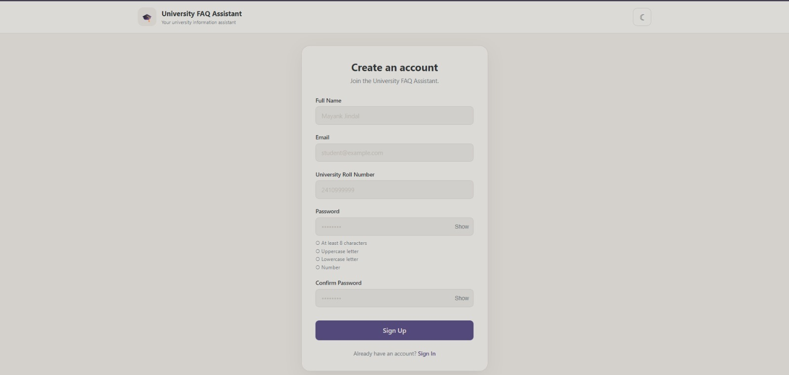
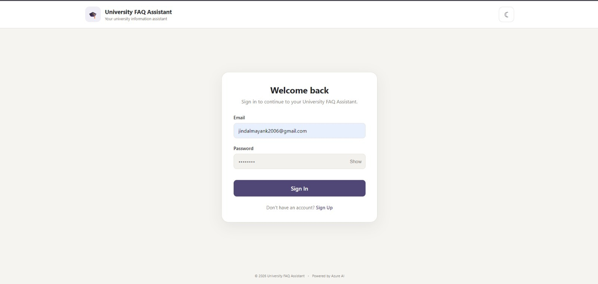
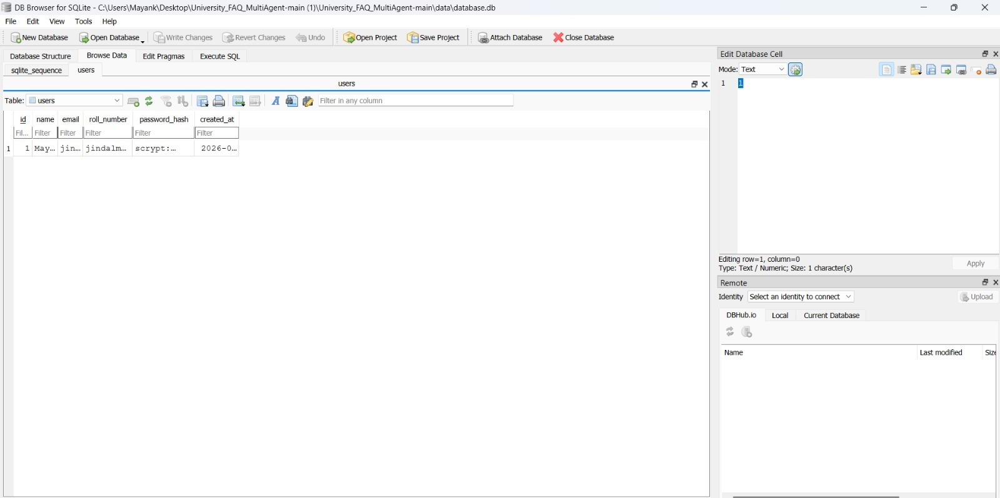

# University FAQ Multi-Agent System

A multi-agent AI system that answers student questions about university fees, academics, placements, hostel, and campus facilities — powered by Microsoft Azure AI Foundry, Azure AI Search, and Azure OpenAI.

---

## Team Members

| Name | Role |
|------|------|
| Madhav Taneja | Team Leader — Campus & Hostel Agent |
| Dhruv Kaushik | Router Agent + Azure AI Search + Microsoft Foundry |
| Aryan Harit | Fees & Academics Agent + Deployment + Azure AI Search |
| Mayank Jindal | Placement Agent |

---

## Problem Statement

University students frequently have questions spanning multiple domains — tuition fees, academic policies, placement records, hostel facilities, and campus life. Traditionally, students must navigate separate offices, portals, and staff members to get answers — a slow, fragmented, and often inconsistent experience. Staff handling repetitive queries wastes administrative time, and students often receive outdated information.

This project solves that by providing a single, accurate, always-available FAQ assistant that intelligently routes questions to domain-specific knowledge and answers them with grounded, document-backed information from actual university files.

---

## Solution Overview

The system is a Flask-based web application backed by a multi-agent pipeline. A student types a question into the chat UI; the question is sent to a Flask API endpoint and passed to a **Router Agent** that classifies it into one of four domains (fees & academics, placements, campus & hostel, or accounts/admin). A **Specialist Agent** for the identified domain retrieves context from a local Markdown FAQ knowledge base and synthesises a preliminary answer. The question is then sent to a **Microsoft Foundry Agent**, which uses **Foundry IQ → Azure AI Search** to retrieve grounded answers from indexed university documents — this is the primary answer source. The final answer (cleaned of citation markers) is returned to the frontend together with exactly three AI-generated follow-up questions.

If Foundry fails, the specialist agent's locally retrieved and LLM-synthesised answer serves as a fallback.

---

## System Architecture

```
User (Browser)
      │
      ▼
Flask Web Application  (app.py / frontend/)
      │  POST /api/ask
      ▼
Router Agent  (agents/router.py)
  ├── Stage 1: Keyword matching (fast path)
  └── Stage 2: Azure OpenAI chat classification (LLM path)
      │
      ├── fees_academics ──► Fees & Academics Agent  (agents/fees_academics.py)
      ├── placements     ──► Placements Agent         (agents/placements.py)
      ├── campus_hostel  ──► Campus & Hostel Agent    (agents/campus_hostel.py)
      ├── accounts_admin ──► (handled inline by router)
      └── unknown        ──► Static fallback response
            │
            ▼  (each specialist agent)
      Local FAQ Search  (tools/search_faq.py)
      Markdown Knowledge Base  (data/raw/*.md)
            │
            ▼
      Azure OpenAI  (tools/llm_client.py)
      Deployment: gpt-4.1-mini  ──► Synthesised specialist answer
            │
            ▼
      Microsoft Foundry Agent  (tools/foundry_client.py)
      azure.ai.projects  AIProjectClient
            │
            ▼
      Foundry IQ
            │
            ▼
      Azure AI Search  ──► Indexed university documents
            │
            ▼
      Grounded Answer + Follow-up Questions
            │
            ▼
      JSON Response  { answer, agent, follow_up_questions, sources }
            │
            ▼
      Frontend  (frontend/templates/index.html)
```

### Component Roles

**Router Agent (`agents/router.py`)** — The central orchestrator. Classifies the incoming question using keyword matching first, and Azure OpenAI chat completion for ambiguous cases. Routes to the correct specialist, calls Foundry, selects the final answer, assembles follow-ups, and returns the response.

**Fees & Academics Agent (`agents/fees_academics.py`)** — Handles questions about tuition fees, scholarships, refunds, CGPA, attendance, courses, examinations, and academic registration. Combines local FAQ search with Foundry retrieval.

**Placements Agent (`agents/placements.py`)** — Handles questions about placement eligibility, companies, recruiters, salary packages, CTC, internships, PPOs, and interviews. Uses `placement_tools.py` to parse structured data from `placements.md`.

**Campus & Hostel Agent (`agents/campus_hostel.py`)** — Handles questions about hostel fees, room types, mess timings, curfew rules, laundry, gym, sports, medical facilities, WiFi, canteen, campus security, and gate passes.

**`tools/foundry_client.py`** — Connects to the Microsoft Foundry project via `AIProjectClient`. The Foundry agent internally uses Foundry IQ and Azure AI Search to retrieve answers from indexed university documents. This is the **primary answer source** for all domains.

**`tools/llm_client.py`** — Azure OpenAI client for chat completion (`gpt-4.1-mini`) and embeddings (`text-embedding-3-small`). Used by the Router Agent for classification and by Specialist Agents for answer synthesis.

**`tools/search_faq.py`** — Lightweight, dependency-free local search over the Markdown knowledge base. Uses token overlap scoring with question (60%), tag (30%), and answer (10%) weights plus an exact-phrase boost.

---

## Data Flow

1. **User submits a question** via the web UI (`POST /api/ask`).
2. **Flask (`app.py`)** validates the JSON payload and calls `handle_question()` in the Router Agent.
3. **Router Agent** classifies the question using domain keyword sets (`FEES_ACADEMICS_KEYWORDS`, `PLACEMENT_KEYWORDS`, `CAMPUS_HOSTEL_KEYWORDS`, `ACCOUNTS_ADMIN_KEYWORDS`). If the keyword stage is ambiguous, an Azure OpenAI chat call with `ROUTER_SYSTEM_PROMPT` resolves the domain.
4. **Specialist Agent** for the domain is invoked. It calls `search_faq()` to retrieve the top-3 relevant FAQ entries from the local Markdown files, then calls Azure OpenAI to synthesise a preliminary answer from that context.
5. **Microsoft Foundry Agent** (`tools/foundry_client.py`) is called. It authenticates to Azure AI Foundry using `InteractiveBrowserCredential`, then invokes the configured Foundry agent (`FOUNDRY_AGENT_NAME`) via `AIProjectClient`. Foundry IQ searches indexed university documents through **Azure AI Search** and returns a grounded, citation-annotated answer.
6. **Answer selection** — If Foundry returns an answer, it is used as the final answer (confidence 0.95). If Foundry fails or returns nothing, the specialist agent's synthesised answer is used as a fallback.
7. **Post-processing** — All source citation markers (`[4:0†source]`, `【4:0†filename.pdf】`, etc.) are stripped from the answer before it is returned.
8. **Follow-up questions** (exactly 3) are assembled in priority order: from Foundry's response, from a dedicated Foundry follow-up generation call, then from the specialist agent's results.
9. **JSON response** `{ answer, agent, follow_up_questions, sources }` is returned to the browser and rendered by the chat frontend.

---

## Technology Stack

| Category | Technology | Purpose |
|----------|------------|---------|
| Language | Python 3.13 | All backend logic |
| Backend framework | Flask 3.1.3 | Web API and HTML template rendering |
| AI/LLM — chat | Azure OpenAI (`gpt-4.1-mini` deployment) | Routing classification, answer synthesis, follow-up generation |
| AI/LLM — embeddings | Azure OpenAI (`text-embedding-3-small` deployment) | Embedding generation (via `tools/llm_client.py`) |
| AI agent platform | Azure AI Foundry (`azure-ai-projects` 2.7.0) | Primary answer source via Foundry IQ and Azure AI Search |
| Document retrieval | Azure AI Search (via Foundry IQ) | Indexes and retrieves grounded answers from university documents |
| Azure authentication | `azure-identity` 1.25.3 | `InteractiveBrowserCredential` for Foundry authentication |
| Local FAQ search | Custom Markdown search (`tools/search_faq.py`) | Token-overlap retrieval from `data/raw/*.md` |
| Knowledge base | Markdown files (`data/raw/`) | Fees, academics, placements, campus/hostel FAQ entries |
| Frontend | HTML / CSS / JavaScript (`frontend/`) | Single-page chat interface |
| Templating | Jinja2 (via Flask) | Server-side HTML rendering |
| Environment config | `python-dotenv` | Loads credentials from `.env` |
| Testing | `pytest` 9.1.1 | Unit and integration tests with `unittest.mock` |
| Version control | Git / GitHub | Source control |

---

## AI Services and Models

### Azure AI Foundry — Primary Answer Source (`tools/foundry_client.py`)

The system connects to an Azure AI Foundry project using `AIProjectClient` from the `azure-ai-projects` SDK. The project endpoint is read from `FOUNDRY_PROJECT_ENDPOINT` and the Foundry agent name from `FOUNDRY_AGENT_NAME`. Authentication is handled by `InteractiveBrowserCredential` from `azure-identity`.

The Foundry agent is the **primary answer source** for all domains. When called, it activates Foundry IQ, which searches indexed university documents via **Azure AI Search** and returns a grounded, document-backed answer. The response may include inline citations (e.g. `[4:0†source]` or `【4:1†campus_hostel.md】`); these are stripped by `_remove_sources()` before the answer reaches the student.

### Azure AI Search — Document Retrieval (via Foundry IQ)

Azure AI Search is used **inside** the Foundry agent pipeline. The Foundry IQ layer queries the Azure AI Search index over university documents (PDFs, Markdown files) and returns semantically relevant passages to ground the Foundry agent's answer. Azure AI Search is not called directly from Python code; it is configured as a connected knowledge source within the Foundry project.

### Azure OpenAI — Classification and Synthesis (`tools/llm_client.py`)

**Chat completion** is used for two purposes:
- **Routing** — The Router Agent sends ambiguous questions to Azure OpenAI with a structured system prompt (`ROUTER_SYSTEM_PROMPT`) that classifies the question into one of five routes: `fees_academics`, `placements`, `campus_hostel`, `accounts_admin`, or `unknown`.
- **Synthesis** — Each Specialist Agent calls Azure OpenAI to synthesise a coherent answer from the locally retrieved FAQ context, used either directly or as a Foundry fallback.

Configured via `AZURE_OPENAI_ENDPOINT`, `AZURE_OPENAI_API_KEY`, and `AZURE_OPENAI_API_VERSION` (`2024-10-21`).

**Embedding** is available via `embed()` in `tools/llm_client.py` using the `text-embedding-3-small` deployment.

### Router Classification Strategy

The Router Agent uses a two-stage classification approach:

**Stage 1 — Keyword matching:** The question is checked against four pre-defined keyword sets. If a clear domain match is found, the LLM call is skipped entirely for speed.

**Stage 2 — LLM classification:** For ambiguous questions, a chat completion request is made to Azure OpenAI with the `ROUTER_SYSTEM_PROMPT`, which instructs the model to return exactly one of the five valid routes.

---

## Project Structure

```text
university_faq/
├── app.py                        # Flask app — serves UI and /api/ask endpoint
├── main.py                       # CLI entry point (interactive Q&A loop)
├── .env                          # Environment variables (not committed to git)
├── .gitignore
│
├── agents/
│   ├── __init__.py
│   ├── router.py                 # Router Agent — classification + orchestration
│   ├── fees_academics.py         # Fees & Academics Specialist Agent
│   ├── placements.py             # Placements Specialist Agent
│   └── campus_hostel.py          # Campus & Hostel Specialist Agent
│
├── tools/
│   ├── __init__.py
│   ├── llm_client.py             # Azure OpenAI client (chat + embeddings)
│   ├── foundry_client.py         # Azure AI Foundry client (primary answers)
│   ├── search_faq.py             # Local Markdown FAQ keyword search
│   └── placement_tools.py        # Placement data loader (parses placements.md)
│
├── data/
│   └── raw/
│       ├── academics.md          # Academic policies FAQ knowledge base
│       ├── fees.md               # Fees and payments FAQ knowledge base
│       ├── campus_hostel.md      # Campus and hostel FAQ knowledge base
│       └── placements.md         # Placements and recruitment FAQ knowledge base
│
├── frontend/
│   ├── templates/
│   │   └── index.html            # Main chat page (Jinja2 template)
│   └── static/
│       ├── css/
│       │   └── style.css
│       └── js/
│           └── app.js
│
├── tests/
│   ├── __init__.py
│   ├── test_router.py            # Router classification and follow-up tests
│   ├── test_fees_academics.py    # Fees & Academics agent tests
│   ├── test_placements.py        # Placements agent tests
│   ├── test_campus_hostel.py     # Campus & Hostel agent tests
│   └── test_llm_client.py        # Azure OpenAI client tests
│
└── README.md
```

---

## Environment Configuration

The following variables must be present in `.env`. **Never commit this file to version control** — it is already excluded via `.gitignore`.

```env
# Azure OpenAI
AZURE_OPENAI_ENDPOINT=
AZURE_OPENAI_API_KEY=
AZURE_OPENAI_API_VERSION=2024-10-21
AZURE_OPENAI_CHAT_DEPLOYMENT=gpt-4.1-mini
AZURE_OPENAI_EMBEDDING_DEPLOYMENT=text-embedding-3-small

# Azure AI Foundry
FOUNDRY_PROJECT_ENDPOINT=
FOUNDRY_AGENT_NAME=
```

> `FOUNDRY_PROJECT_ENDPOINT` and `FOUNDRY_AGENT_NAME` must point to your deployed Foundry project and agent. Azure AI Search is configured as a connected knowledge source within the Foundry project itself — no separate search credentials are required in `.env`.

---

## Running the Application

```bash
# Create and activate a virtual environment (optional)
python -m venv venv
venv\Scripts\activate      # Windows
source venv/bin/activate   # macOS / Linux

# Install dependencies
pip install -r requirements.txt

# Run the Flask web server
python app.py
# Open http://127.0.0.1:5000 in your browser

# Run the CLI (interactive mode)
python main.py

# Run tests
pytest tests/
```

> On first run, `InteractiveBrowserCredential` will open a browser window for Microsoft login to authenticate with Azure AI Foundry.

---

## Screenshots

### Azure AI Search — Knowledge Source Configuration

The knowledge source `university-faq-knowledge` is configured inside Microsoft Foundry with the index `university-faq-knowledge-index`. It uses the `text-embedding-3-small` model for text vectorisation and holds all indexed university documents. All files show status **Ready**, confirming successful indexing.


> **Files indexed:** `Fee_Notification_July-Dec_2026_AISearch.pdf`, `University_FAQ_Academics_AzureAI_NormalData`, `Hostel-Rules-2023-24.pdf`, `Chitkara_Fee_Brochure_Azure_AI_Search_Normal`, `campus_hostel.md`, `engineering-brochure-2026-azure-compact.pdf`, `placements.md`

---

### Azure AI Foundry — Resource Overview

The Foundry resource `universityfaq-azure-2026` is deployed under **CHITKARA UNIVERSITY** in the `koreacentral` region, linked to the `Azure for Students` subscription. API Kind is `AIServices` with status `Succeeded`.



---

### Application Demo — Hostel Facilities Query (Dark Mode)

A student asks *"What are the hostel facilities?"* The system routes the question to the **Campus & Hostel** agent, retrieves a grounded answer from the indexed university documents via Azure AI Search, and returns a structured response with three auto-generated follow-up questions.



---

### Application Demo — Placement Process Query (Light Mode)

A student asks *"What is the placement process?"* The system routes the question to the **Placements** agent and returns a step-by-step answer covering drives, screening, selection stages, industry network, and industry-readiness preparation. The UI supports both light and dark themes.



---

---

## Additional Screenshots — Setup, Auth & Data Storage

This section captures the full picture of the deployed system: how the Azure AI Search knowledge source and Azure AI Foundry resource are configured, what the chat assistant looks like in use, and the **Sign Up / Sign In flow** that now sits in front of the chat assistant. The project is now entered through authentication first — a student creates an account or signs in before reaching the chat UI — and user accounts are persisted in a local **SQLite** database (`data/database.db`) rather than any external service.

### Azure AI Search — Knowledge Source (`university-faq-knowledge`)

The knowledge source is configured inside Microsoft Foundry with the index `university-faq-knowledge-index`, using the `text-embedding-3-small` deployment for text vectorisation. All source documents — fee notifications, academic FAQs, hostel rules, fee brochures, the engineering brochure, and the `campus_hostel.md` / `placements.md` knowledge files — show status **Ready**, confirming they are fully indexed and searchable.



### Azure AI Foundry — Resource Overview (`universityfaq-azure-2026`)

The Foundry resource is deployed under **CHITKARA UNIVERSITY**, in the `koreacentral` region, under the `Azure for Students` subscription. Its API Kind is `AIServices` and its provisioning status is `Succeeded`, confirming the resource backing the Router → Specialist → Foundry pipeline is live and reachable.


### Chat Assistant — Hostel Facilities Query (Dark Mode)

A student asks *"What are the hostel facilities?"*. The Router Agent classifies the question into the **Campus & Hostel** domain, the answer is grounded via Azure AI Search, and the assistant returns a structured, bulleted response along with three auto-generated follow-up questions.



### Chat Assistant — Placement Process Query (Light Mode)

A student asks *"What is the placement process?"*. The **Placements** agent returns a numbered, step-by-step explanation of drives, recruiter screening, selection stages, and industry readiness. The same interface supports both light and dark themes.



### Sign Up — Create an Account

Before reaching the chat assistant, a new student creates an account with their **full name, email, university roll number, and password**. Password strength rules (minimum 8 characters, uppercase, lowercase, and a number) are enforced client-side before the account is created.



### Sign In — Welcome Back

Returning students sign in with their registered email and password. On successful authentication, the student is taken straight into the chat assistant shown above — **the application now starts from this Sign Up / Sign In flow**, not directly at the chat screen.



### SQLite — Stored User Data (`data/database.db`)

User accounts created via Sign Up are persisted locally in a **SQLite** database. The `users` table (viewed here in DB Browser for SQLite) stores `id`, `name`, `email`, `roll_number`, a hashed `password_hash` (via `scrypt`), and `created_at` — no plaintext passwords are ever stored.



### Auth & Storage — Files Added

The table below maps the new authentication flow to the files and layers it lives in:

| File | Layer |
|------|-------|
| `signup.html` | Frontend |
| `index.html` | Frontend |
| `auth.py` | Backend |
| `db.py` | Database schema |
| `data/database.db` | Database |

For further implementation details on authentication, password hashing, and the SQLite schema, refer to `auth.py` and `db.py` directly in the repository.

---

## Responsible AI

This system was designed with Microsoft's Responsible AI principles in mind across all six dimensions: privacy, security, fairness, transparency, reliability, and human oversight. The sections below explain how each principle is addressed in the actual implementation.

---

### Privacy

The system does not collect, store, or log any personally identifiable information (PII). Student questions are passed directly through the pipeline and are never written to a database or persistent storage. No user accounts, session histories, or query logs are retained between requests.

API credentials (Azure OpenAI key, Foundry endpoint) are stored exclusively in a `.env` file that is explicitly excluded from version control via `.gitignore`, preventing accidental exposure of secrets in the repository. Authentication to Azure AI Foundry uses `InteractiveBrowserCredential`, which delegates identity management to Microsoft's secure OAuth flow rather than embedding user credentials in code.

The knowledge base (`data/raw/*.md`) contains only official university policy documents — no student records, personal data, grades, or private information of any individual.

---

### Security

All communication with Azure services (Azure OpenAI, Azure AI Foundry, Azure AI Search) takes place over HTTPS using the official Azure SDKs (`azure-ai-projects`, `openai`, `azure-identity`), which enforce TLS encryption in transit.

Secrets are never hard-coded. The `.env` file pattern ensures credentials are environment-specific and are not bundled into the application code or Docker images. The `.gitignore` file is pre-configured to exclude `.env` from all commits.

The Flask API validates and sanitises all incoming requests. Empty or malformed payloads return structured 400/500 error responses without leaking internal stack traces to the client. The router's `unknown` domain route acts as a boundary: questions outside the university knowledge domain are refused gracefully rather than passed to the LLM with no guardrails.

---

### Fairness

The system answers every student's question using the same fixed set of official university documents regardless of who is asking. There is no personalisation, profiling, or differential treatment based on any student attribute. All four specialist agents — fees & academics, placements, campus & hostel, and accounts/admin — apply identical retrieval and synthesis logic to every query they receive.

The knowledge base is sourced exclusively from official university policy documents, which are themselves subject to the institution's own fairness obligations. Placement data in `placements.md` presents factual records (companies, packages, roles) without filtering or ranking by any demographic dimension.

The system prompt given to Azure OpenAI explicitly instructs the model not to invent university information and to clearly indicate when information cannot be found — reducing the risk of speculative or biased outputs that could disadvantage particular students.

---

### Transparency

The API response always includes an `agent` field that tells the frontend — and by extension the student — which domain handled the question (`fees_academics`, `placements`, `campus_hostel`, `router`). This makes the routing decision visible and auditable.

The Router Agent's two-stage classification approach (keyword matching, then LLM classification) is fully documented in `agents/router.py` with explicit keyword sets that can be inspected, tested, and updated by the university team. The system prompt used for LLM-based routing (`ROUTER_SYSTEM_PROMPT`) is a plain-text string in the source code, not a black box.

Answers are grounded in indexed university documents via Azure AI Search. While Foundry's inline citation markers are stripped from the final answer shown to students (to avoid cluttering the UI), the architecture ensures the answer originates from official documents rather than from unconstrained model generation. The `ANSWER_SYSTEM_PROMPT` explicitly instructs the model to state when information is not found rather than fabricating an answer.

---

### Reliability

The system is built with a two-layer fallback architecture. Microsoft Foundry (backed by Azure AI Search over university documents) is the primary answer source. If Foundry fails or returns an empty response, the specialist agent's locally retrieved and LLM-synthesised answer is used automatically, so the student always receives a response.

The local FAQ search (`tools/search_faq.py`) is a lightweight, dependency-free module with no external network calls, making it robust to external service outages. It has a deterministic scoring function (question 60%, tag 30%, answer 10% token overlap) that can be verified and unit tested independently of any AI service.

All five agent paths (`fees_academics`, `placements`, `campus_hostel`, `accounts_admin`, `unknown`) have defined behaviour for every possible input, including empty questions, out-of-domain questions, and API errors. The `unknown` route returns a structured, helpful fallback response rather than an error. The test suite (`tests/`) covers routing classification, specialist agent responses, and the Azure OpenAI client with mocked API calls, providing a regression safety net.

---

### Human Oversight

The system is designed to assist students, not to replace human staff. When a question falls outside all known domains, the `unknown` route returns a message directing students to the university helpdesk. Each specialist agent includes a `FALLBACK_ANSWER` that instructs the student to contact the university directly if the system cannot help.

The entire knowledge base is maintained as human-readable Markdown files (`data/raw/*.md`) that university staff can read, update, and version-control without any AI tooling. Adding new FAQ entries, correcting outdated information, or removing content requires only a text editor and a Git commit — no model retraining or redeployment.

The keyword sets in the Router Agent (`FEES_ACADEMICS_KEYWORDS`, `PLACEMENT_KEYWORDS`, etc.) are plain Python sets that any developer or administrator can review and extend. The system prompts given to Azure OpenAI are plain strings in the source code, making it straightforward for a human reviewer to audit what instructions the AI is operating under.

Azure AI Foundry and Azure OpenAI are both governed by Microsoft's own Responsible AI commitments, content filtering policies, and usage monitoring — providing an additional institutional layer of oversight above the application level.
